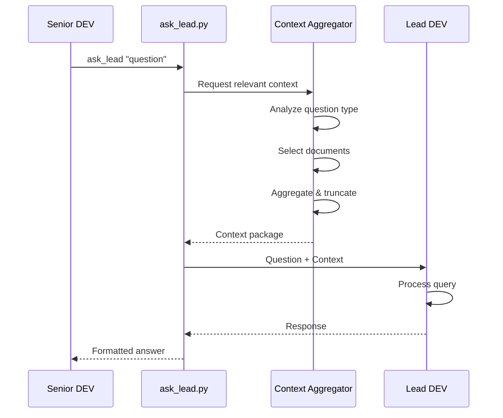
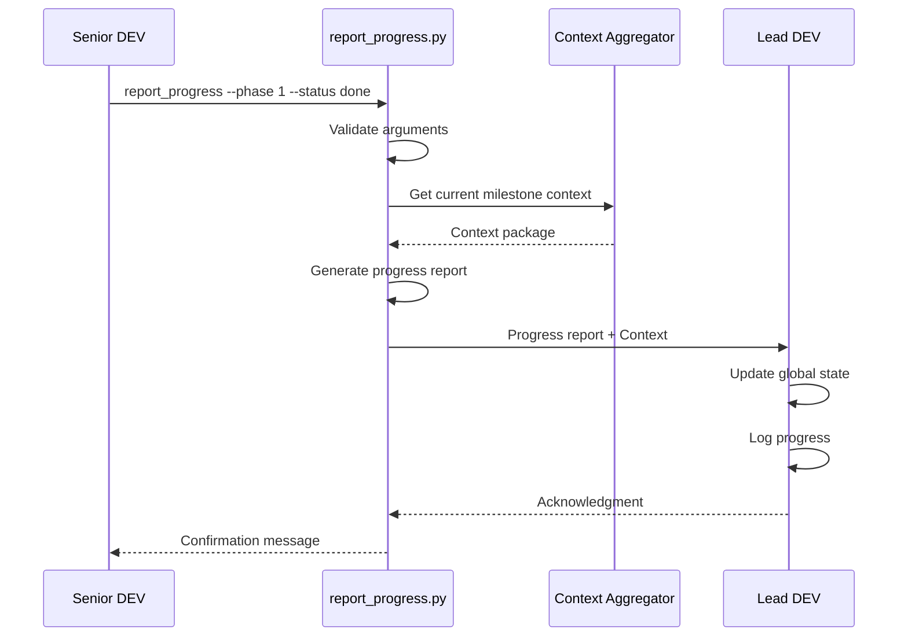
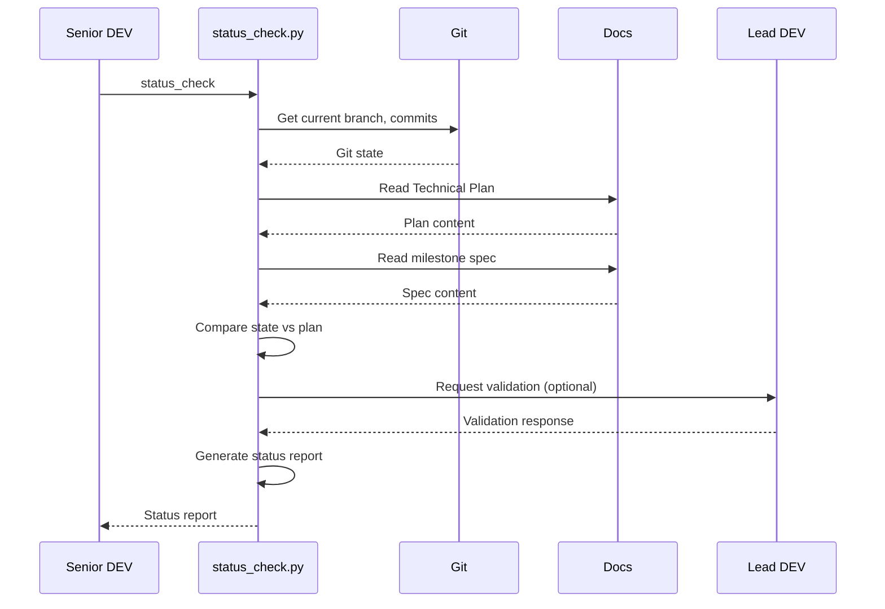
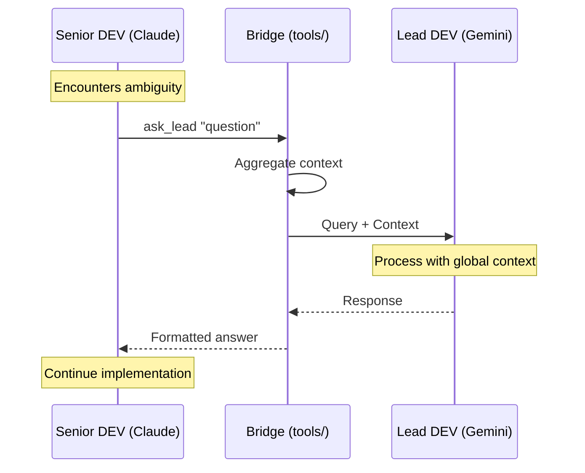
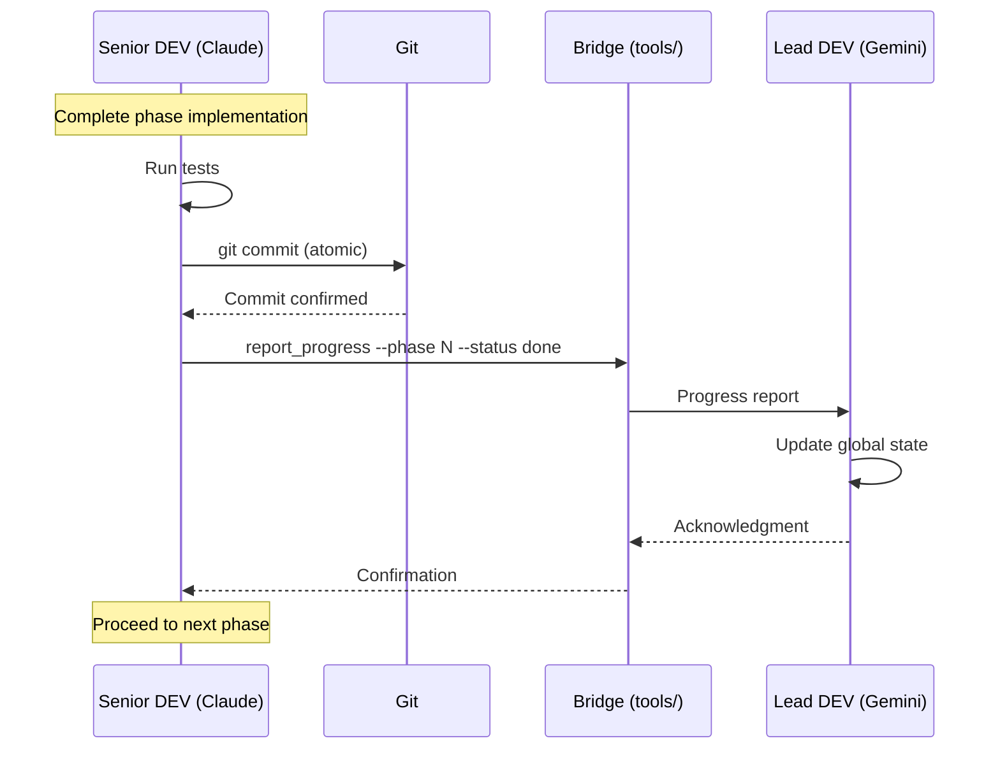
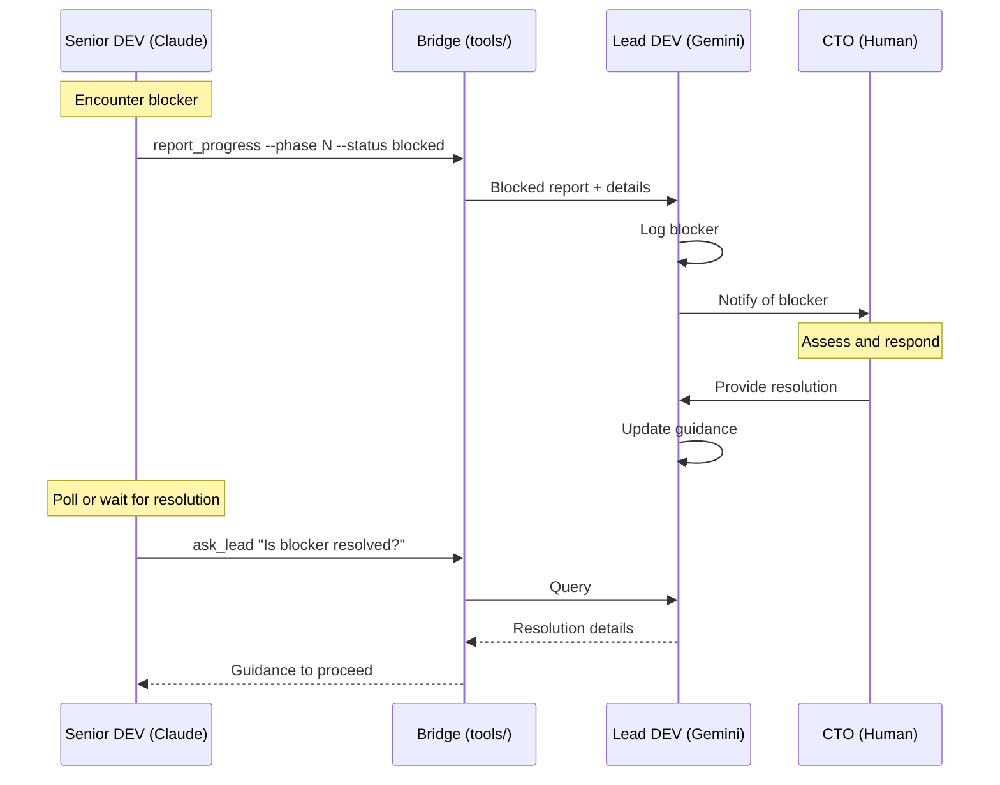
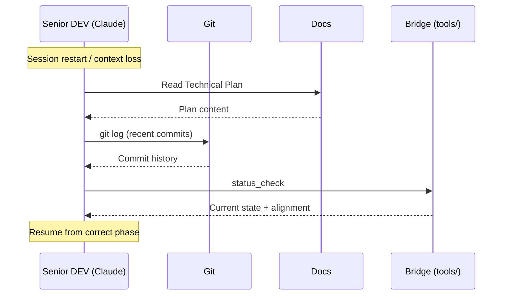

# Global Architecture

This document describes the technical architecture of the Hierarchical Multi-Agent System (HMAS), with particular focus on the Bridge Layer that enables communication between agents.

## 1. Technology Stack

| Component | Technology | Purpose |
|-----------|------------|---------|
| Lead DEV | Gemini CLI | Strategic planning, global context management |
| Senior DEV | Claude Code | Code execution, implementation |
| Bridge Layer | Python 3.x scripts | Inter-agent communication |
| Environment | Linux / CLI | Execution environment |
| Documentation | Markdown | State tracking, specifications |
| Version Control | Git | Change tracking, atomic commits |

### Environment Requirements

**Python:**
- Version: 3.8+ (for modern type hints and asyncio support)
- Required packages: See `tools/requirements.txt` (when implemented)

**System:**
- POSIX-compliant shell (bash/zsh)
- Git 2.x+
- Network access for API calls (Lead DEV communication)

**AI Agent Sessions:**
- Gemini CLI session for Lead DEV
- Claude Code session for Senior DEV
- Both sessions must be active during development cycles

## 2. Core Principles

### 2.1 Decoupled Strategy & Execution

Strategy (what to build, why, architectural decisions) is separated from execution (how to build, implementation details). This prevents context drift by ensuring:

- Lead DEV maintains the "source of truth" for strategy
- Senior DEV focuses on tactical execution
- Neither agent's context becomes bloated with the other's concerns

### 2.2 Pull-Based Interaction

Senior DEV **pulls** context from Lead DEV; Lead DEV never **pushes** instructions.

```
Traditional (Push):       HMAS (Pull):
┌──────────┐             ┌──────────┐
│ Lead DEV │             │ Lead DEV │
└────┬─────┘             └────▲─────┘
     │ push                   │ respond
     ▼                        │
┌──────────┐             ┌────┴─────┐
│Senior DEV│             │Senior DEV│
└──────────┘             └──────────┘
  (passive)               (proactive)
```

**Benefits:**
- Senior DEV controls its context window
- Only relevant information is transferred
- Lead DEV context stays uncontaminated by implementation details

### 2.3 Atomic Commits

Every phase completion in a Technical Plan corresponds to a single git commit:

- **Traceability:** Commits map to documented phases
- **Reversibility:** Issues isolate to specific phases
- **Auditability:** Change history tells the project story

### 2.4 Auditability

Every decision must be traceable through documentation:

- Architectural decisions → `ARCHITECTURE.md`
- Milestone specifications → `docs/01_milestones/`
- UAT feedback → `docs/99_audit/`
- Query/response history → Bridge logs (future enhancement)

## 3. The Bridge Layer

The Bridge Layer is the communication infrastructure enabling the pull-based model. It consists of Python scripts in the `tools/` directory that Senior DEV invokes to interact with Lead DEV.

### 3.1 Architecture Overview

```
┌─────────────────────────────────────────────────────────────┐
│                      BRIDGE LAYER                           │
│                                                             │
│  ┌───────────┐    ┌───────────┐    ┌───────────────┐       │
│  │ ask_lead  │    │  report   │    │ status_check  │       │
│  │           │    │ _progress │    │               │       │
│  └─────┬─────┘    └─────┬─────┘    └───────┬───────┘       │
│        │                │                  │               │
│        └────────────────┼──────────────────┘               │
│                         │                                  │
│                ┌────────▼────────┐                         │
│                │ Context         │                         │
│                │ Aggregator      │                         │
│                └────────┬────────┘                         │
│                         │                                  │
│                ┌────────▼────────┐                         │
│                │ Lead DEV        │                         │
│                │ Interface       │                         │
│                └────────┬────────┘                         │
└─────────────────────────┼───────────────────────────────────┘
                          │
                          ▼
                   ┌──────────────┐
                   │   Lead DEV   │
                   │   (Gemini)   │
                   └──────────────┘
```

### 3.2 Directory Structure

```
tools/
├── ask_lead.py           # Query tool for clarifications
├── report_progress.py    # Progress reporting tool
├── status_check.py       # Alignment validation tool
├── lib/
│   ├── __init__.py
│   ├── context.py        # Context aggregation logic
│   ├── interface.py      # Lead DEV communication interface
│   └── config.py         # Configuration management
├── requirements.txt      # Python dependencies
└── README.md             # Tool documentation
```

### 3.3 Context Aggregation Strategy

When a Bridge tool executes, it aggregates relevant documentation to provide context to Lead DEV. This ensures Lead DEV has the information needed to respond accurately.

#### Aggregation Rules

| Query Type | Documents Included |
|------------|-------------------|
| Architectural question | `ARCHITECTURE.md`, `ROADMAP.md`, relevant milestone spec |
| Implementation question | Current milestone spec, `ARCHITECTURE.md` |
| Progress report | Current milestone spec, Technical Plan |
| Status check | Current milestone spec, Technical Plan, git status |

#### Context Selection Algorithm

```
1. Always include:
   - Query/report content
   - Current phase identifier

2. Based on query type, include:
   - ARCHITECTURE.md (for architectural questions)
   - ROADMAP.md (for timeline/scope questions)
   - Current milestone spec (always for non-trivial queries)
   - Technical Plan (if exists and relevant)

3. Size limits:
   - Maximum context size: Configurable (default: 8000 tokens)
   - Truncation strategy: Prioritize most recent, most relevant

4. Never include:
   - Source code files (unless explicitly requested)
   - Other milestone specs (unless cross-referenced)
   - Audit logs (unless debugging)
```

## 4. Bridge Tool Specifications

### 4.1 `ask_lead` - Clarification Queries

**File:** `tools/ask_lead.py`

**Purpose:** Query Lead DEV for architectural decisions, requirement clarifications, or implementation guidance.

#### Interface

```bash
python tools/ask_lead.py "<question>"
```

#### Arguments

| Argument | Type | Required | Description |
|----------|------|----------|-------------|
| `question` | string | Yes | The question to ask Lead DEV |

#### Options

| Option | Type | Default | Description |
|--------|------|---------|-------------|
| `--context` | string | auto | Override automatic context selection |
| `--format` | string | text | Output format: `text`, `json`, `markdown` |
| `--verbose` | flag | false | Include debug information |

#### Behavior



#### Return Values

| Exit Code | Meaning |
|-----------|---------|
| 0 | Success - response received |
| 1 | Error - Lead DEV unreachable |
| 2 | Error - invalid query format |
| 3 | Error - context aggregation failed |

#### Output Format

**Success (text):**
```
[LEAD DEV RESPONSE]
<response content>
[END RESPONSE]
```

**Success (json):**
```json
{
  "status": "success",
  "response": "<response content>",
  "context_used": ["ARCHITECTURE.md", "M1_Documentation.md"],
  "timestamp": "2024-01-15T10:30:00Z"
}
```

**Error:**
```
[ERROR] <error description>
```

#### Examples

```bash
# Basic query
python tools/ask_lead.py "Should user sessions persist across server restarts?"

# With JSON output
python tools/ask_lead.py --format json "What authentication method should I use?"

# With verbose logging
python tools/ask_lead.py --verbose "How should errors be reported to users?"
```

---

### 4.2 `report_progress` - Progress Reporting

**File:** `tools/report_progress.py`

**Purpose:** Report phase/milestone completion status to Lead DEV, enabling global state updates.

#### Interface

```bash
python tools/report_progress.py --phase <N> --status <status> [--message "<details>"]
```

#### Arguments

| Argument | Type | Required | Description |
|----------|------|----------|-------------|
| `--phase` | integer | Yes | Phase number from Technical Plan |
| `--status` | enum | Yes | Status: `done`, `blocked`, `review` |
| `--message` | string | No | Additional details or notes |
| `--milestone` | string | No | Override current milestone identifier |

#### Status Values

| Status | Meaning | Lead DEV Action |
|--------|---------|-----------------|
| `done` | Phase completed successfully | Update progress tracker, unlock next phase |
| `blocked` | Cannot proceed without intervention | Flag for CTO/Lead attention |
| `review` | Ready for human or Lead review | Notify stakeholders, pause execution |

#### Behavior



#### Return Values

| Exit Code | Meaning |
|-----------|---------|
| 0 | Success - progress recorded |
| 1 | Error - Lead DEV unreachable |
| 2 | Error - invalid arguments |
| 3 | Error - phase not found in plan |

#### Output Format

**Success:**
```
[PROGRESS RECORDED]
Phase: 1
Status: done
Milestone: M1_Documentation
Timestamp: 2024-01-15T10:30:00Z
[END REPORT]
```

**Blocked status includes:**
```
[PROGRESS RECORDED]
Phase: 2
Status: blocked
Milestone: M1_Documentation
Message: External API dependency unavailable
Action Required: CTO/Lead DEV intervention
[END REPORT]
```

#### Examples

```bash
# Phase completed
python tools/report_progress.py --phase 1 --status done

# Phase blocked with details
python tools/report_progress.py --phase 2 --status blocked --message "Waiting for API credentials"

# Ready for review
python tools/report_progress.py --phase 3 --status review --message "Authentication flow ready for UAT"
```

---

### 4.3 `status_check` - Alignment Validation

**File:** `tools/status_check.py`

**Purpose:** Validate current execution state against the active plan; detect drift or misalignment.

#### Interface

```bash
python tools/status_check [--verbose] [--fix]
```

#### Options

| Option | Type | Default | Description |
|--------|------|---------|-------------|
| `--verbose` | flag | false | Show detailed status information |
| `--fix` | flag | false | Attempt automatic remediation of minor issues |
| `--milestone` | string | auto | Check specific milestone instead of current |

#### Behavior



#### Checks Performed

1. **Git State:**
   - Current branch matches expected
   - No uncommitted changes (warning if present)
   - Commit history aligns with completed phases

2. **Documentation State:**
   - Technical Plan exists and is readable
   - Current phase is identified
   - Milestone spec is accessible

3. **Progress Alignment:**
   - Completed phases match git history
   - Current phase is valid next step
   - No skipped phases

#### Return Values

| Exit Code | Meaning |
|-----------|---------|
| 0 | Aligned - no issues detected |
| 1 | Warning - minor issues (can proceed) |
| 2 | Misaligned - significant drift detected |
| 3 | Error - cannot determine status |

#### Output Format

**Aligned:**
```
[STATUS CHECK - ALIGNED]
Milestone: M1_Documentation
Current Phase: 2 of 4
Completed Phases: 1
Git Status: Clean
Last Commit: abc123 "docs: update WORKFLOW.md"
[END STATUS]
```

**Warning:**
```
[STATUS CHECK - WARNING]
Milestone: M1_Documentation
Current Phase: 2 of 4
Warnings:
  - Uncommitted changes detected (3 files)
  - Last commit 2 hours ago
Recommendation: Commit changes or stash before proceeding
[END STATUS]
```

**Misaligned:**
```
[STATUS CHECK - MISALIGNED]
Milestone: M1_Documentation
Issues:
  - Phase 1 marked done but no corresponding commit
  - Current branch 'feature-x' does not match expected 'main'
Action Required: Run 'ask_lead' for remediation guidance
[END STATUS]
```

## 5. Inter-Agent Communication Flows

### 5.1 Standard Query Flow



### 5.2 Phase Completion Flow



### 5.3 Blocked Progress Flow



### 5.4 Context Recovery Flow



## 6. Configuration

### 6.1 Configuration File

**Location:** `tools/config.yaml` (or environment variables)

```yaml
# Bridge Layer Configuration
bridge:
  # Lead DEV connection settings
  lead_dev:
    interface: "gemini-cli"  # or "api"
    timeout: 30  # seconds
    retry_count: 3
    retry_delay: 5  # seconds

  # Context aggregation settings
  context:
    max_tokens: 8000
    include_architecture: true
    include_roadmap: false  # only when needed
    truncation_strategy: "recent_first"

  # Output settings
  output:
    default_format: "text"  # text, json, markdown
    include_timestamps: true
    log_queries: true
    log_file: "tools/logs/bridge.log"

# Project settings
project:
  docs_path: "docs/"
  milestones_path: "docs/01_milestones/"
  architecture_file: "docs/00_global/ARCHITECTURE.md"
  roadmap_file: "docs/00_global/ROADMAP.md"
```

### 6.2 Environment Variables

| Variable | Description | Default |
|----------|-------------|---------|
| `HMAS_LEAD_INTERFACE` | Lead DEV interface type | `gemini-cli` |
| `HMAS_CONTEXT_MAX_TOKENS` | Maximum context size | `8000` |
| `HMAS_LOG_LEVEL` | Logging verbosity | `INFO` |
| `HMAS_CONFIG_PATH` | Path to config file | `tools/config.yaml` |

## 7. Error Handling

### 7.1 Connection Errors

**Symptom:** Bridge tool cannot reach Lead DEV

**Handling:**
1. Automatic retry with exponential backoff
2. After max retries, return error code 1
3. Log detailed error for debugging
4. Suggest checking Lead DEV session status

### 7.2 Context Errors

**Symptom:** Required documents not found or unreadable

**Handling:**
1. Log missing document warning
2. Proceed with available context if non-critical
3. Return error code 3 if critical context missing
4. Suggest running `status_check` for diagnosis

### 7.3 Invalid Input

**Symptom:** Malformed arguments or queries

**Handling:**
1. Return error code 2 immediately
2. Display usage help
3. Provide specific error message

## 8. Future Enhancements

The following are planned for future iterations:

- **Query caching:** Reduce redundant queries with TTL-based caching
- **Response history:** Searchable log of all ask_lead queries and responses
- **Batch operations:** Multiple progress reports in single invocation
- **Health monitoring:** Proactive checks for Lead DEV availability
- **Analytics dashboard:** Visualization of communication patterns

## 9. Quick Reference

### Tool Commands

```bash
# Ask a question
python tools/ask_lead.py "Your question here"

# Report progress
python tools/report_progress.py --phase N --status done|blocked|review

# Check alignment
python tools/status_check
```

### Exit Codes

| Code | ask_lead | report_progress | status_check |
|------|----------|-----------------|--------------|
| 0 | Success | Success | Aligned |
| 1 | Lead unreachable | Lead unreachable | Warning |
| 2 | Invalid query | Invalid args | Misaligned |
| 3 | Context error | Phase not found | Cannot determine |

### Directory Layout

```
hhl-mas/
├── docs/
│   ├── 00_global/
│   │   ├── ARCHITECTURE.md    ← You are here
│   │   ├── WORKFLOW.md
│   │   └── ROADMAP.md
│   ├── 01_milestones/
│   └── 99_audit/
├── tools/
│   ├── ask_lead.py
│   ├── report_progress.py
│   ├── status_check.py
│   └── lib/
└── .gemini/
```
