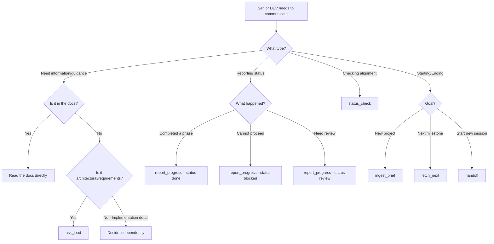

# AI-Driven Development Workflow: HMAS Protocol

This document details the **Hierarchical Multi-Agent System (HMAS)** protocol for software development.

## 1. The Core Thesis

Traditional AI coding fails because of **Context Drift**—as conversations grow, AI agents lose track of earlier decisions, introduce contradictions, and forget architectural constraints. This protocol solves this by:

1. **Decoupling Context from Execution:** Strategy (Lead DEV) is separated from implementation (Senior DEV)
2. **Pull-Based Communication:** Senior DEV actively requests only the context it needs, when it needs it
3. **Lean Context Windows:** Each query aggregates only relevant documentation, preventing bloat

### Why Pull-Based Over Push-Based?

| Aspect | Push-Based (Traditional) | Pull-Based (HMAS) |
|--------|--------------------------|-------------------|
| Context Flow | Lead pushes instructions to Senior | Senior pulls context from Lead |
| Context Size | Grows unbounded over time | Stays lean per-query |
| Senior DEV Role | Passive executor waiting for orders | Proactive engineer driving progress |
| Lead DEV Role | Active manager constantly directing | Reactive oracle responding to queries |
| Drift Risk | High - accumulated context diverges | Low - fresh context per interaction |

## 2. Roles (The Triangle of Power)

```
                    ┌─────────────┐
                    │     CTO     │
                    │   (Human)   │
                    │ "The Stop   │
                    │   Button"   │
                    └──────┬──────┘
                           │
              Business Alignment & UAT
                           │
         ┌─────────────────┴─────────────────┐
         │                                   │
         ▼                                   ▼
┌─────────────────┐                 ┌─────────────────┐
│    Lead DEV     │◄────Bridge─────►│   Senior DEV    │
│    (Gemini)     │    (Pull)       │    (Claude)     │
│  "The Brain"    │                 │  "The Hands"    │
│   Reactive      │                 │   Proactive     │
└─────────────────┘                 └─────────────────┘
```

### 2.1 CTO (Human Operator)
- **Access:** Root / God Mode
- **Function:** "The Stop Button." Ensures the project aligns with business value
- **Interactions:**
  - Provides initial project briefs
  - Performs UAT (User Acceptance Testing)
  - Grants green lights for phase progression
  - Can intervene at any point to redirect
- **Deliverables:** Project briefs, UAT logs, Go/No-Go decisions

### 2.2 Lead DEV (The "Brain" - Gemini CLI)
- **Persona:** Engineering Manager and Software Architect
- **Function:** Manages global state, documentation, and high-level planning
- **Interaction Model:** **Passive/Reactive**
  - Does NOT initiate communication with Senior DEV
  - Responds ONLY when queried via the Bridge
  - Maintains the "source of truth" in documentation
- **Context Responsibility:** Owns the global project context in `.gemini/` and `docs/`
- **Deliverables:**
  - `ARCHITECTURE.md` - System architecture and technical decisions
  - `ROADMAP.md` - High-level project timeline
  - Milestone Specs in `docs/01_milestones/`
  - Responses to `ask_lead` queries

### 2.3 Senior DEV (The "Hands" - Claude Code)
- **Persona:** Pragmatic Software Engineer
- **Function:** Executes plans, writes code, runs tests, drives progress
- **Interaction Model:** **Active/Pull**
  - Proactively pulls context when needed
  - Does NOT wait for instructions to be pushed
  - Uses `tools/` to fetch specific context
- **Context Responsibility:** Maintains local execution context; requests global context on-demand
- **Deliverables:**
  - Source code and implementation
  - Unit tests and integration tests
  - Technical Plans for milestone execution
  - Progress reports via `report_progress`

## 3. Inter-Agent Communication (The Bridge)

The Bridge Layer is the communication mechanism between Senior DEV and Lead DEV. It enforces the **pull-based model** by providing tools that Senior DEV uses to request context.

### 3.1 Bridge Tools Overview

| Tool | Purpose | Direction | When to Use |
|------|---------|-----------|-------------|
| `ask_lead` | Query for clarification or decisions | Senior → Lead | Ambiguous requirements, architectural questions |
| `report_progress` | Report phase/task completion | Senior → Lead | After completing a phase or significant milestone |
| `status_check` | Validate alignment with plan | Senior → Lead | Before starting work, mid-execution validation |
| `ingest_brief` | Bootstrap new project/milestone | CTO/Lead → System | At project start or major module inception |
| `fetch_next` | Milestone progression | Senior → Lead | After completing all phases of a milestone |
| `handoff` | Session context renewal | User/Senior → New Session | When starting a fresh Claude Code session |

### 3.2 Tool Usage Guide

[Existing tools: ask_lead, report_progress, status_check documentation...]

#### `ingest_brief` - Project Inception

**Purpose:** Convert a raw text brief into a structured HMAS project skeleton.

**Usage:**
```bash
python tools/ingest_brief.py "Build a secure file storage API"
```

#### `fetch_next` - Milestone Progression

**Purpose:** Transition from one milestone to the next by archiving the current one and fetching the next spec.

**Usage:**
```bash
python tools/fetch_next.py
```

#### `handoff` - Session Context Renewal

**Purpose:** Generate a "System Prompt" that summarizes everything the Senior DEV needs to know to resume work in a clean session.

**Usage:**
```bash
python tools/handoff.py --next
```

### 3.3 Decision Tree: Which Tool to Use?



## 4. The Grand Workflow Lifecycle

### Phase 1: Inception & Architecture

**Owner:** CTO + Lead DEV

1. CTO creates `project_brief.txt` or a prompt.
2. System bootstraps using `python tools/ingest_brief.py`.
3. System generates:
   - `docs/00_global/ARCHITECTURE.md`
   - `docs/00_global/ROADMAP.md`
   - Initial milestone specs in `docs/01_milestones/`
4. CTO reviews and approves architecture.

### Phase 2: The Build Loop (Feature Milestones)

[Existing content...]

3. **Senior DEV creates Technical Plan:** Breaks milestone into executable phases.
4. **Clarification loop:** Use `ask_lead` for any ambiguities (now supports **Interactive Mode**).
5. **Plan finalized:** Technical Plan is ready for execution.

#### 2C: Transition Sub-Phase

1. **Progress:** Run `fetch_next.py` to archive the current milestone.
2. **Renew:** Run `handoff.py --next` to get the prompt for the next session.
3. **Boot:** Open a new Senior DEV session and paste the handoff prompt.

#### 2B: Execution Sub-Phase (Per Phase)

1. **Pull context:** Read current phase requirements from Technical Plan
2. **Validate alignment:** Run `status_check` to ensure no drift
3. **Implement:** Write code and tests for the phase
4. **Test:** Run all relevant tests
5. **Commit:** Create atomic commit for the phase (see Section 5)
6. **Report:** Run `report_progress --phase N --status done`
7. **Loop:** Return to step 1 for next phase

### Phase 3: Human Interface (UAT)

**Owner:** CTO

1. CTO tests delivered features
2. Feedback logged in `docs/99_audit/`
3. Issues tagged for next iteration or hotfix

**Senior DEV involvement:** Responds to bug reports, implements fixes

### Phase 4: Consolidation

**Owner:** Lead DEV + Senior DEV

1. Lead DEV synthesizes UAT feedback
2. Lead DEV updates documentation with learnings
3. Senior DEV pulls consolidation tasks via Bridge
4. Technical debt addressed if prioritized

### Phase 5: Deployment

**Owner:** Senior DEV (with Lead DEV guidance)

1. Senior DEV queries Lead DEV for deployment requirements
2. Senior DEV generates deployment artifacts
3. Senior DEV executes deployment procedure
4. Status reported via `report_progress`

## 5. Atomic Commit Strategy

Every phase completion in a Technical Plan corresponds to exactly one git commit. This ensures:

- **Traceability:** Each commit maps to a documented phase
- **Reviewability:** Changes are logically grouped
- **Revertability:** Issues can be isolated to specific phases

### Commit Message Format

```
<type>: <short description>

[Optional body with details]

Phase: <milestone>.<phase>
```

**Types:**
- `feat`: New feature
- `fix`: Bug fix
- `docs`: Documentation only
- `refactor`: Code restructuring
- `test`: Test additions/modifications
- `chore`: Maintenance tasks

**Examples:**
```
feat: implement user authentication flow

Added login, logout, and session management endpoints.
Password hashing uses bcrypt with cost factor 12.

Phase: M2.3
```

```
docs: comprehensive workflow and architecture documentation

Phase: M1.2
```

### Commit Timing

- Commit **after** tests pass for the phase
- Commit **before** running `report_progress`
- Never commit partial/broken phases

## 6. Error Handling & Edge Cases

### 6.1 Query Failures

**Scenario:** `ask_lead` returns an error or no response

**Resolution:**
1. Retry once after brief delay
2. Check if Lead DEV session is active
3. If persistent, report via `report_progress --status blocked`
4. Document issue in local notes for CTO awareness

### 6.2 Conflicting Information

**Scenario:** Documentation contradicts `ask_lead` response

**Resolution:**
1. Always prefer the most recent `ask_lead` response (newer context)
2. Use `ask_lead` to explicitly clarify the conflict
3. Request Lead DEV update documentation if needed

### 6.3 Scope Creep Detection

**Scenario:** Implementation reveals requirements not in spec

**Resolution:**
1. Do NOT implement undocumented requirements independently
2. Use `ask_lead` to clarify if the requirement is in scope
3. If out of scope, document for future milestone
4. Proceed only with what's explicitly specified

### 6.4 Blocked Progress

**Scenario:** Cannot proceed with current phase

**Resolution:**
1. Document the blocker clearly
2. Run `report_progress --phase N --status blocked`
3. Include blocker details in the report
4. Wait for Lead DEV/CTO intervention or proceed to non-blocked work

### 6.5 Context Loss Recovery

**Scenario:** Senior DEV session restarts or loses context

**Resolution:**
1. Read the active Technical Plan
2. Check git log for last completed phase
3. Run `status_check` to validate state
4. Resume from the appropriate phase

## 7. Best Practices

### For Senior DEV (Claude Code)

1. **Pull Early, Pull Often:** Don't hesitate to use `ask_lead` when uncertain
2. **Stay Lean:** Only request the context you need for the current phase
3. **Report Promptly:** Run `report_progress` immediately after phase completion
4. **Trust the Plan:** Follow the Technical Plan; don't deviate without clarification
5. **Atomic Work:** Complete one phase fully before starting the next

### For Lead DEV (Gemini CLI)

1. **Be Explicit:** Responses to `ask_lead` should be unambiguous and actionable
2. **Update Docs:** Keep documentation current with all decisions
3. **Stay Reactive:** Don't push unsolicited instructions to Senior DEV
4. **Scope Clearly:** Milestone specs should have clear boundaries

### For CTO (Human)

1. **Clear Briefs:** Initial requirements should be as detailed as possible
2. **Timely UAT:** Don't let completed work sit without testing
3. **Trust the System:** Let agents work autonomously within the protocol
4. **Intervene Decisively:** When you do intervene, be clear and explicit

## 8. Quick Reference

### Senior DEV Daily Workflow

```bash
# 1. Check current state
python tools/status_check

# 2. Review current phase in Technical Plan
# (Read docs/01_milestones/current_milestone.md)

# 3. If questions arise
python tools/ask_lead.py "Your question here"

# 4. Implement and test

# 5. Commit
git add -A && git commit -m "feat: description

Phase: MX.Y"

# 6. Report completion
python tools/report_progress.py --phase Y --status done

# 7. Repeat for next phase
```

### Emergency Procedures

| Situation | Action |
|-----------|--------|
| Lead DEV unresponsive | Notify CTO, document state, pause |
| Tests consistently failing | `report_progress --status blocked` |
| Spec has critical error | `ask_lead` for clarification, don't proceed |
| Need CTO decision | `report_progress --status review` with notes |
